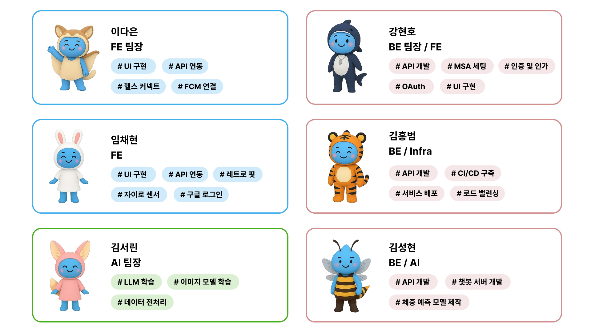
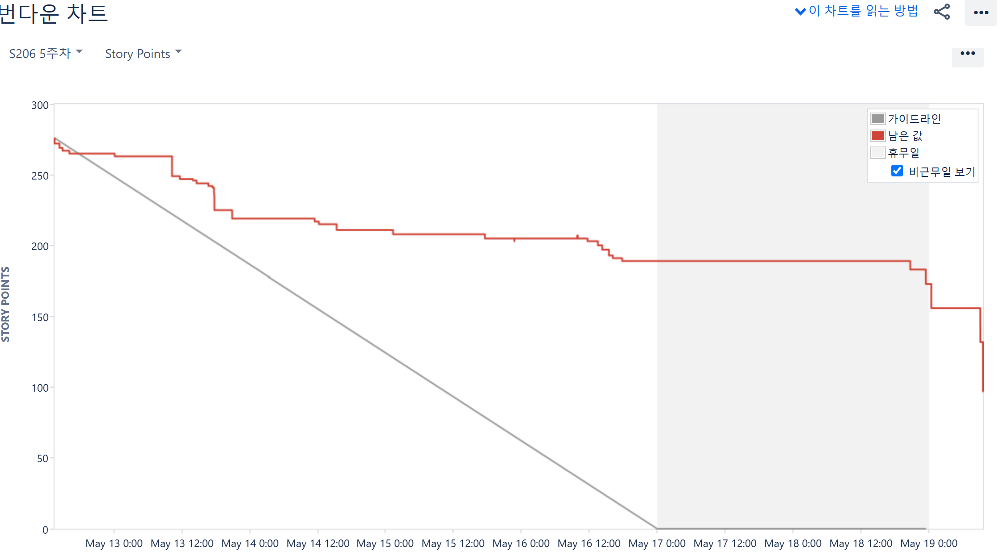

# ❤️‍🩹 개인 AI 건강 관리 서비스앱 Dia Viseo


<br>

## ✨ 프로젝트 소개

**디아비서**는 개인의 건강 데이터를 체계적으로 관리하고 AI 기반 분석을 통해 맞춤형 건강 솔루션을 제공하는 통합 건강 관리 플랫폼입니다. <br>

사용자의 `체중, 운동, 식단, 수면` 등 다양한 건강 지표를 하나의 플랫폼에서 관리하며, 개인별 건강 상태와 목표에 맞는 맞춤형 피드백과 개선 방안을 제시합니다. <br>

<br>

## 🔑 주요 서비스

#### 1. `통합 건강 대시보드`<br>

다양한 건강 지표를 한 곳에서 시각적으로 관리하고 개인의 건강 트렌드를 쉽게 파악할 수 있습니다. <br>

#### 2. `AI 기반 개인화 서비스`<br>

사용자의 건강 데이터를 분석하여 맞춤형 목표 설정, 식단 추천, 운동 가이드를 제공합니다. <br>

#### 3. `스마트 목표 관리`<br>

개인별 건강 목표를 설정하고 진행상황을 추적하며 성취도를 분석하는 시스템을 제공합니다. <br>

#### 4. `식단 관리 & 영양 분석`<br>

식단 기록과 영양소 분석을 통해 개인화된 식단 추천 서비스를 제공합니다. <br>

#### 5. `스마트 알림 시스템`<br>

개인 패턴을 학습하여 효과적인 시점에 운동, 식단 관리 알림을 제공합니다. <br>

#### 6. `서비스 목표`<br>

개인의 건강 데이터를 체계적으로 관리하고, 맞춤형 건강 관리 솔루션을 제공하여 사용자의 건강한 라이프스타일 구축을 지원합니다.

<br>

## 👥 팀원 구성



<br>

## 🔧 개발 환경

### 📱 **Front-end**


<br>


### 💻 **Back-end**


<br>


<br>


### 🌐 **서비스 배포 환경**


<br>


<br>


### 🗂️ **버전 및 이슈관리**


### 🤝 **협업 툴**


### 🎨 **디자인**


<br>

## 🧭 브랜치 전략

- `Git-flow 전략`을 기반으로 `master`, `dev` 브랜치와 `feature` 보조 브랜치를 운용했습니다.
- `master`, `dev`, `feature` 브랜치로 나누어 개발을 하였습니다.
  - `master` 브랜치는 배포 단계에서만 사용하는 브랜치입니다.
  - `develop` 브랜치는 개발 단계에서 git-flow의 master 역할을 하는 브랜치입니다.
  - `feature` 브랜치는 기능 단위로 독립적인 개발 환경을 위하여 사용하고 merge 후 각 브랜치를 삭제해주었습니다.

<br>

## 📂 프로젝트 구조

<details>
<summary>BE</summary>

```
BE/
├── auth-service/
│   └── src/main/java/com/s206/auth/
│       ├── AuthServiceApplication.java
│       ├── controller/
│       ├── service/
│       ├── dto/
│       ├── jwt/
│       ├── security/
│       ├── client/
│       └── config/
├── common-module/
│   └── src/main/java/com/s206/common/
│       ├── dto/
│       ├── exception/
│       ├── security/
│       └── webclient/
├── config-service/
│   └── src/main/java/com/s206/config/
│       └── ConfigServiceApplication.java
├── eureka-service/
│   └── src/main/java/com/s206/eureka/
│       └── EurekaServiceApplication.java
├── gateway-service/
│   └── src/main/java/com/s206/gateway/
│       ├── GatewayServiceApplication.java
│       ├── filter/
│       ├── config/
│       ├── blacklist/
│       └── util/
├── health-service/
│   └── src/main/java/com/s206/health/
│       ├── HealthServiceApplication.java
│       ├── bodyinfo/
│       │   ├── controller/
│       │   ├── service/
│       │   ├── entity/
│       │   └── dto/
│       ├── condition/
│       │   ├── controller/
│       │   ├── service/
│       │   ├── entity/
│       │   └── dto/
│       ├── exercise/
│       │   ├── controller/
│       │   ├── service/
│       │   ├── entity/
│       │   └── dto/
│       ├── nutrition/
│       │   ├── controller/
│       │   ├── service/
│       │   ├── entity/
│       │   └── dto/
│       ├── step/
│       │   ├── controller/
│       │   ├── service/
│       │   ├── entity/
│       │   └── dto/
│       ├── notification/
│       │   ├── controller/
│       │   ├── service/
│       │   ├── entity/
│       │   └── dto/
│       ├── client/
│       ├── config/
│       └── elastic/
└── user-service/
    └── src/main/java/com/s206/user/
        ├── UserServiceApplication.java
        ├── user/
        │   ├── controller/
        │   ├── service/
        │   ├── entity/
        │   ├── dto/
        │   └── config/
        └── physical/
            ├── controller/
            ├── service/
            ├── entity/
            └── dto/

```

</details>

<details>
<summary>FE</summary>

```
FE/
└── mobile/
    └── src/main/java/com/example/diaviseo/
        ├── MainActivity.kt
        ├── MyApplication.kt
        ├── MyFirebaseMessagingService.kt
        ├── data/
        │   ├── datastore/
        │   │   ├── TokenDataStore.kt
        │   │   ├── FcmTokenManager.kt
        │   │   ├── StepDataStore.kt
        │   │   └── HealthConnectDataStore.kt
        │   ├── network/
        │   │   ├── RetrofitInstance.kt
        │   │   ├── dto/
        │   │   │   ├── ApiResponse.kt
        │   │   │   ├── request/
        │   │   │   └── response/
        │   │   └── service/
        │   │       ├── AuthApiService.kt
        │   │       ├── UserApiService.kt
        │   │       ├── HealthApiService.kt
        │   │       ├── ConditionApiService.kt
        │   │       ├── ChatBotApiService.kt
        │   │       └── AlarmApiService.kt
        │   └── model/
        │       ├── User.kt
        │       ├── Health.kt
        │       ├── Exercise.kt
        │       ├── Nutrition.kt
        │       └── ChatMessage.kt
        ├── feature/
        │   ├── auth/
        │   │   ├── AuthScreen.kt
        │   │   ├── AuthViewModel.kt
        │   │   └── GoogleLoginManager.kt
        │   ├── onboarding/
        │   │   ├── OnboardingScreen.kt
        │   │   └── OnboardingViewModel.kt
        │   ├── home/
        │   │   ├── HomeScreen.kt
        │   │   ├── HomeViewModel.kt
        │   │   └── components/
        │   ├── health/
        │   │   ├── HealthScreen.kt
        │   │   ├── HealthViewModel.kt
        │   │   ├── register/
        │   │   │   ├── HealthRegisterScreen.kt
        │   │   │   └── HealthRegisterViewModel.kt
        │   │   └── components/
        │   ├── chat/
        │   │   ├── ChatScreen.kt
        │   │   ├── ChatViewModel.kt
        │   │   └── components/
        │   ├── profile/
        │   │   ├── ProfileScreen.kt
        │   │   ├── ProfileViewModel.kt
        │   │   └── edit/
        │   └── goal/
        │       ├── GoalScreen.kt
        │       ├── GoalViewModel.kt
        │       └── components/
        ├── shared/
        │   ├── components/
        │   │   ├── BottomNavigationBar.kt
        │   │   ├── CommonTopBar.kt
        │   │   ├── LoadingOverlay.kt
        │   │   ├── DeleteDialog.kt
        │   │   └── DiaDatePickerDialog.kt
        │   ├── theme/
        │   │   ├── Colors.kt
        │   │   ├── Font.kt
        │   │   ├── Theme.kt
        │   │   └── Type.kt
        │   └── utils/
        │       ├── FCMInitializer.kt
        │       ├── FcmTokenSender.kt
        │       └── GalleryPermissionHandler.kt
        ├── healthconnect/
        │   ├── HealthConnectManager.kt
        │   ├── HealthConnectPermissionHandler.kt
        │   ├── processor/
        │   └── worker/
        └── navigation/
            └── AppNavigation.kt

```

</details>
<br>

## 🗓️ 개발 기간 및 작업 관리

### `개발 기간`

- 전체 개발 기간 : 2025.04.14 ~ 2025.05.22
- UI 구현 : 2025.04.22 ~ 2025.05.20
- 기능 구현 : 2025.04.22 ~ 2025.05.12

<br>

### `작업 관리`

- #### **GitLab**을 사용하여 MergeRequest에 서로 코드 리뷰를 하면서 피드백을 공유 했습니다.

  

- #### **Jira**를 통해서 서로의 작업 현황을 파악하고 개발 일정을 관리했습니다.
  

<br>

## 🏗️ 시스템 아키텍처


<br>

## ✨ 페이지별 기능

### [스플래시]

### [소셜 로그인]

### [온보딩]

### [홈 화면]

<br>

## 🗒️ 프로젝트 후기

### 🐶 강현호

건강관리 앱이라는 주제는 평소에도 관심이 많았던 분야였기에, 이번 디아비전 연계 프로젝트는 저에게 의미 있는 도전이었습니다.
백엔드뿐만 아니라 프론트엔드 구현에도 직접 참여하면서, 서비스 전반의 흐름을 더 깊이 이해하고 사용자 입장에서의 개발에 대해 고민해볼 수 있는 기회가 되었습니다.

OAuth2 기반의 소셜 로그인, JWT 발급과 검증, Redis를 활용한 토큰 저장 및 관리, Gateway의 커스텀 필터 구현 등 인증과 보안 구조 전반을 맡아 개발했습니다.
마이크로서비스 환경에서 서비스 간 인증 흐름을 어떻게 설계해야 하는지를 실제로 부딪히며 익힐 수 있었고, 작은 요소 하나도 사용자 경험에 직결된다는 점을 절감했습니다.

또한 Config Server를 이용한 중앙 설정 관리와 공통 응답 및 예외 처리를 위한 common-module 구성을 통해, 여러 서비스가 일관된 구조로 동작할 수 있도록 정비했습니다.
이 과정에서 관리 효율성과 유지보수성의 중요성도 함께 배울 수 있었습니다.

특히 기능을 분리한 MSA 구조 속에서, 각자의 책임을 이해하고 존중하는 분위기 덕분에 협업이 원활하게 이루어졌습니다.
서로의 코드를 리뷰하고, 수정 방향을 함께 고민하는 과정에서 많은 것을 배울 수 있었고, 단순한 분업을 넘어 함께 설계하고 성장하는 팀워크를 경험할 수 있었습니다.

User, Meal, Food, Statistic 등 주요 도메인의 API와 통계 처리 로직 구현에도 폭넓게 관여하며, 단순히 동작하는 코드를 넘어서 데이터 흐름의 구조적 안정성에 대해서도 고민하게 되었습니다.

이번 프로젝트는 단순히 기술을 적용하는 것을 넘어서, 협업과 사용자 중심의 관점에서 개발을 바라보는 계기가 되었습니다.
팀원들과 함께 문제를 나누고 해결해가는 과정이 무엇보다도 값졌으며, 앞으로도 이 경험을 바탕으로 실제 서비스에 필요한 개발을 꾸준히 이어가고 싶습니다.

<br>
    
### 🦁 김성현

평소 관심이 많았던 건강관리 앱 개발 프로젝트를 디아비전과의 기업 연계를 통해 진행할 수 있어 더욱 즐겁고 깊이 몰입할 수 있었습니다.
그중에서도 알림 시스템 구현 업무가 가장 기억에 남습니다.
문제를 정확히 인식하기 위해 팀원들과 소통하며 방향을 맞췄습니다.

RabbitMQ와 FCM을 활용해 비동기 기반의 확장 가능한 구조를 설계했고, 사용자 경험을 고려해 알림 전송 시점도 함께 조율했습니다.
또한, AI 챗봇과 연동하여 사용자 기록을 기반으로 한 운동 피드백 알림 기능도 시도했습니다.
향후에는 알림 실패 감지 및 예외 자동 처리 기능을 추가해, 시스템의 안정성과 완성도를 더욱 높일 계획입니다.

이 프로젝트를 통해 기술을 주도적으로 선택하고 설계하는 역량을 키울 수 있었으며,
무엇보다도 디아비전 멘토님들과 S206팀 팀원들과 함께하며 일에 대한 열정과 책임감의 중요성을 깊이 느낄 수 있었습니다.

소중한 경험을 할 수 있도록 기회를 주신 SSAFY, 디아비전, 그리고 함께한 S206팀에 진심으로 감사드립니다. (\*>∇<)ﾉ

<br>

### 🐯 김홍범

건강관리 앱이라는 주제는 평소에도 관심이 많았던 분야였기에, 이번 디아비전 연계 프로젝트는 저에게 의미 있는 도전이었습니다. 기업이 요구하는 요구사항을 최대한 반영하려고 노력하는 과정에서 사용자 관점에서의 개발이 무엇인지 깨닫게 되는 계기가 되었던 것 같습니다.

특히 인프라 담당으로서 사용자가 겪을 수 있는 서비스 중단이나 성능 저하를 방지하기 위해 Kubernetes 기반의 자동 확장 및 복구 시스템을 구축했습니다. HPA를 통해 CPU 사용률이 70%를 넘으면 자동으로 파드가 확장되도록 설정하고, ReplicaSet을 통해 항상 안정적인 수의 파드가 운영되도록 했기 때문에 서비스의 연속성을 보장할 수 있었습니다.

또한 ElasticSearch를 활용한 음식 검색 기능과 MinIO 객체 스토리지를 통한 이미지 관리 시스템을 구현하면서, 대용량 데이터 처리와 검색 성능 최적화에 대한 실무 경험을 쌓을 수 있었습니다. 이 과정에서 모니터링을 하기 위해서 Grafana와 Prometheus를 통한 실시간 메트릭 수집 및 알림 시스템을 구축했기 때문에 잠재적 문제를 사전에 감지하고 대응할 수 있는 체계를 만들 수 있었습니다.

특히 마이크로서비스 환경에서 각 서비스 간의 협업과 데이터 흐름을 설계하는 과정에서, 단순한 기능 구현을 넘어서 시스템 전체의 안정성과 확장성을 고려하는 사고방식을 기를 수 있었습니다.

이 경험을 통해 "개발자에게 편한 코드"와 "사용자에게 가치있는 서비스" 사이의 차이를 명확히 이해하게 되었고, 앞으로도 항상 사용자 경험을 최우선으로 고려하는 개발자가 되겠다는 다짐을 하게 되었습니다.

<br>

### 🐤 김서린

AI를 깊이 있게 배우고 싶어 이번 프로젝트에 참여하게 되었습니다. 초반에는 생소한 개념들이 많아 막막했지만, 직접 모델을 다루고 데이터를 분석하면서 점차 AI의 흐름과 구조에 대해 이해할 수 있었습니다.

특히 LLM을 파인튜닝하고, 데이터 전처리를 진행하며 YOLO를 활용한 이미지 인식 모델을 학습시킨 경험은 AI 분야에 한 걸음 더 다가가는 소중한 기회였습니다. 예상치 못한 어려움도 많았지만, 팀원들과 적극적으로 소통하며 함께 해결해 나갈 수 있어 더욱 의미 있었습니다.

이번 프로젝트를 통해 AI에 대한 관심과 흥미가 훨씬 더 커졌고, 앞으로도 관련 분야에 적극적으로 도전해 나갈 계획입니다. 이번 경험은 저에게 큰 자신감을 심어주었고, 실제 서비스를 만드는 데 AI가 어떻게 활용될 수 있는지 체감할 수 있는 시간이었습니다.

<br>

### 🐰 임채현

디아비전과 함께하는 프로젝트를 통해 처음으로 안드로이드 앱 개발에 참여할 수 있었습니다.

생명주기 관리와 백그라운드 작업의 중요성을 실감했고, DataStore, WorkManager 사용과 Retrofit과 OkHttp라이브러리 사용으로 api 연동 등 실무적인 기술 경험을 쌓았습니다. 제한된 모바일 환경에서 클릭 횟수를 줄이고 AI의 건강관리 실시간 피드백을 제공하는 UX 설계에도 집중했으며, 웹 개발과는 다른 앱만의 접근성 고민이 필요함을 깨달았습니다. 팀원들과 애자일하게 소통하며 기업 요구사항을 해석하고, 우선순위를 정해 효율적으로 개발을 진행하려 노력했습니다.

Figma와 Jira 등 협업 도구를 적극 활용했지만, 일정 관리와 리스크 대응에서는 아쉬움이 남았습니다. 특히 예기치 못한 AI 모델 개발 기간 연장 요청에 버퍼 기간을 두지 않아 다른 작업 또한 그에 맞춰 밀려서 야간 작업이 발생한 점이 반성됩니다. 다음에는 주간 리스크 평가 회의를 도입하여 개선할 계획입니다.

이번 프로젝트를 통해 기술적 역량뿐 아니라, 명확한 의사소통과 리더십, 그리고 요구사항 문서화의 중요성을 배웠습니다. 앞으로 실제 사용자에게 가치를 주는 개발자의 자세를 다지는 계기가 되었습니다.

<br>

### 🐻 이다은

이번 프로젝트는 Android 앱 개발에 본격적으로 몰입하게 된 첫 실전 프로젝트였습니다.

‘디아비전’과의 실제 협업을 통해, 단순한 기능 구현을 넘어서 실사용자 관점에서 서비스 구조와 UX 흐름을 함께 고민하는 경험을 할 수 있었습니다.

초기에는 Jetpack Compose의 선언형 UI 방식이나 Health Connect의 비동기 데이터 흐름이 익숙하지 않아 시행착오도 있었지만, 직접 구조를 설계하고 기능을 구현하며 Android 앱 개발의 전체 흐름을 스스로 구축해볼 수 있었습니다.

특히 Health Connect 데이터 연동, FCM 기반 푸시 알림, WorkManager를 활용한 자동 동기화 등 실무에서 자주 활용되는 Android 컴포넌트들을 직접 다뤄본 경험은 Android 개발자로서의 기술적 기반을 탄탄히 다지는 데 큰 도움이 되었습니다.

또한 기업 측과의 협업 과정에서는 기획서 해석, 피드백 반영, 사용자 흐름 중심의 UI/UX 설계 등 실제 서비스 제작 과정에서 요구되는 커뮤니케이션 능력과 설계 감각을 함께 키울 수 있었습니다.

단순히 앱을 만드는 것을 넘어, 사용자 중심의 흐름을 설계하고, 안정적인 데이터 처리 구조를 구축하는 경험을 통해 Android 개발자로서 한 단계 성장할 수 있었습니다.
