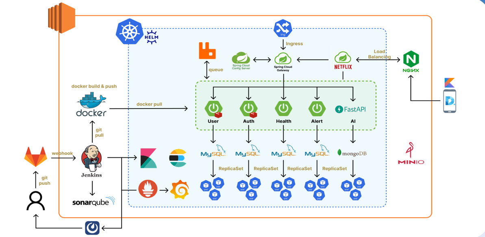

# 디아비서 (DiaViseo) 개발자 문서

**📌 개인 건강 데이터를 통합 관리하고 AI 기반 분석 기능을 제공하는 건강관리 플랫폼**

```
📦 diaviseo/
├── README.md                # 프로젝트 메인 안내
│
├── backend/                 # MSA 백엔드 서비스
│   ├── auth-service/
│   ├── user-service/
│   ├── health-service/
│   ├── alert-service/
│   ├── gateway-service/
│   ├── config-service/
│   ├── eureka-service/
│   ├── common-module/
│   └── overview.md          # 백엔드 전체 아키텍처 문서
│
├── frontend/                # Android 모바일 앱
│   ├── src/
│   ├── overview.md          # 프론트엔드 구조 및 기능 설명
│   └── README.md
│
├── ai/                      # AI/ML 서비스
│   ├── api-spec.md
│   └── overview.md          # OCR, 챗봇 등 AI 기능 개요
│
└── docs/                    # 설계 및 배포 문서
    ├── architecture/
    ├── api-specs/
    └── deployment/
```

* **개발 기간:** 2025.04.11 ~ 2025.05.23
* **팀 구성:** 백엔드 3명, 안드로이드 2명, AI 1명
* **기술 스택:** Spring Boot, Kotlin, MySQL, Redis, Elasticsearch, MinIO, RabbitMQ, Docker

---

## 📌 프로젝트 개요

**디아비서(DiaViseo)**는 개인 맞춤형 건강관리 플랫폼입니다.
사용자의 체성분, 식단, 운동 데이터를 통합 관리하며, **AI 기반 개인화 분석**과 **스마트 알림**을 제공합니다.

### 🎯 핵심 기능
* **Google OAuth 소셜 로그인** 및 JWT 기반 인증
* **OCR 기반 체성분(InBody) 데이터 자동 인식**
* **Health Connect 연동** 자동 걸음수/운동 데이터 수집
* **Elasticsearch 기반 음식 검색** 및 식단 기록
* **개인화된 건강 목표 설정** 및 달성률 추적
* **AI 챗봇** 건강 상담 및 맞춤 피드백
* **FCM 푸시 알림** 기록 리마인더 및 동기부여

### 🏗️ 기술적 특징
* **마이크로서비스 아키텍처(MSA)** - 서비스별 독립 배포 및 확장
* **비동기 메시징(RabbitMQ)** - 서비스 간 느슨한 결합
* **분산 데이터 저장** - MySQL, Redis, Elasticsearch, MinIO

---

## 🧩 전체 시스템 구조

```
┌─────────────────────────────────────────────────────────┐
│                    DiaViseo System                     │
├─────────────────────────────────────────────────────────┤
│                                                         │
│  Android App ──────► Gateway Service (8080)            │
│                            │                           │
│  ┌─────────────────────────┼─────────────────────────┐  │
│  │     Infrastructure     │      Business Services │  │
│  │                        │                         │  │
│  │  Config Service (8888) │  ┌─── Auth Service      │  │
│  │  Eureka Service (8761) │  ├─── User Service      │  │
│  │  Gateway Service       │  ├─── Health Service    │  │
│  │                        │  └─── Alert Service    │  │
│  └────────────────────────┼─────────────────────────┘  │
│                           │                            │
│  ┌─────────────────────────┼─────────────────────────┐  │
│  │       Data Layer       │      External APIs      │  │
│  │                        │                         │  │
│  │  MySQL (사용자/건강)     │  Google OAuth API       │  │
│  │  Redis (세션/캐시)       │  CoolSMS API           │  │
│  │  Elasticsearch (검색)   │  Firebase FCM          │  │
│  │  MinIO (이미지 저장)     │  OCR API               │  │
│  │  RabbitMQ (메시징)      │                         │  │
│  └─────────────────────────┴─────────────────────────┘  │
│                                                         │
└─────────────────────────────────────────────────────────┘
```

---

## 🗂️ 주요 문서

| 카테고리 | 문서 | 설명 |
|---------|-----|------|
| **🏗️ 아키텍처** | [Backend Overview](backend/overview.md) | MSA 구조, 서비스 간 통신, 데이터 흐름 |
| **📱 클라이언트** | [Frontend Overview](frontend/overview.md) | Android 앱 구조, UI/UX, API 연동 |
| **🤖 AI/ML** | [AI Overview](ai/overview.md) | OCR, 챗봇, 이미지 분석 기능 |
| **📊 설계** | [ERD 문서](docs/database-design.md) | 데이터베이스 스키마 및 관계 |
| **🎨 디자인** | [Figma 링크](#) | UI/UX 디자인 시스템 |

---

## ⚙️ 빠른 시작

### 🔧 개발 환경 요구사항
```bash
# Backend
- Java 17+
- Spring Boot 3.4.5

# Frontend  
- Android Studio
- Kotlin
- Jetpack Compose

# External Services
- MySQL 8.0+
- Redis 7.0+
- Elasticsearch 8.0+
- MinIO
- RabbitMQ
```

### 🚀 로컬 실행
```bash

📍 상세한 환경 설정 및 실행 방법은 소스코드의 /exec 폴더의 포팅 메뉴얼 참조
```

---

## 👥 팀 구성

| 역할 | 이름 | 주요 담당                                                                                                                                                                                                        | 연락처                |
|-----|------|--------------------------------------------------------------------------------------------------------------------------------------------------------------------------------------------------------------|--------------------|
| **Backend** | 강현호 | • Eureka Service (서비스 디스커버리)<br/>• Gateway Service (API 라우팅, 인증)<br/>• Auth Service (OAuth, JWT 토큰 관리)<br/>• User Service (회원 관리, SMS 인증)<br/>• Health Service (영양/알레르기/질환 관리)<br/>• Android 챗봇 기능, 마이페이지 개발 | hhwj2270@gmail.com |
| **Backend/AI** | 김성현 | AI Service, Health Service(체성분 관리)                                                                                                                                                                           | aruesin2@gmail.com |
| **Backend/INFRA** | 김홍범 | 담당 업무                                                                                                                                                                                                        | hong@example.com   |
| **Frontend** | 이다은 | 담당 업무                                                                                                                                                                                                        | lee@example.com    |
| **Frontend** | 임채현 | 담당 업무                                                                                                                                                                                                        | lim@example.com    |
| **AI** | 김서린 | 담당 업무                                                                                                                                                                                                        | seo@example.com    |

---


